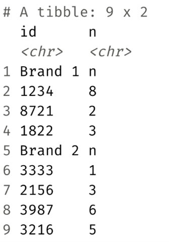
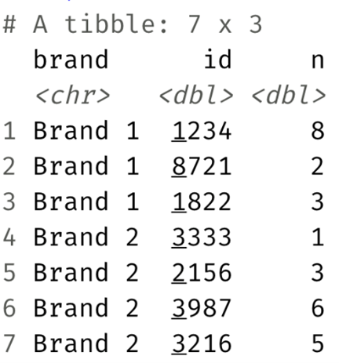

# Project 7 – Data Types and Data Import

Welcome to Project 7! You will write all of your code in **`project7.R`** and commit/push your work back to GitHub Classroom.


## Getting Started
1. **Clone** your GitHub Classroom repository.
2. Open **`project7.R`** and follow the TODOs.
3. Make sure the `data-raw/` folder contains:
   - `cat-lovers.csv`
   - `nobel.csv`
   - `sales.xlsx`
4. If you create any files, write them to the **`data/`** folder.

## What You’ll Do
### Q1 – Importing & Cleaning
- Read `data-raw/cat-lovers.csv`.
- Clean obvious issues (types, trimming, missing values).
- Compute average, min, and max cats per person.

### Q2 – Data Conversion
For each vector, guess the type, then verify with `typeof()` and `class()`. Note anything surprising.
```r
c(1, 1L, "C")
c(1L / 0, "A")
c(1:3, 5)
c(3, "3+")
c(NA, TRUE)
```

### Q3 – Import & Export
- Read `data-raw/nobel.csv`.
- Split into:
  - `nobel_stem` – Physics, Medicine, Chemistry, Economics
  - `nobel_nonstem` – everything else
- Write to `data/nobel_stem.csv` and `data/nobel_nonstem.csv`.

> Hint: Use `%in%` in `dplyr::filter()`.

### Q4 – Import & Clean Excel

Read `data-raw/sales.xlsx` to get it into this format:
<br>
<p align="left">
  
</p>

Then clean it so it looks like this:
<br>
<p align="left">
  
</p>

- Save a cleaned CSV to `data/sales_clean.csv`.

## Submission
1. **Commit** your changes with informative messages.
2. **Push** to GitHub.
3. Confirm your work appears on GitHub (check `project7.R` and any output CSVs).

## Troubleshooting
- **File not found**: check your working directory and folder names; run `getwd()`.
- **Package not found**: install with `install.packages("readr")` (etc.).
- **CSV writing fails**: create `data/` first (the script will do this automatically).

Good luck, and commit early/often!
